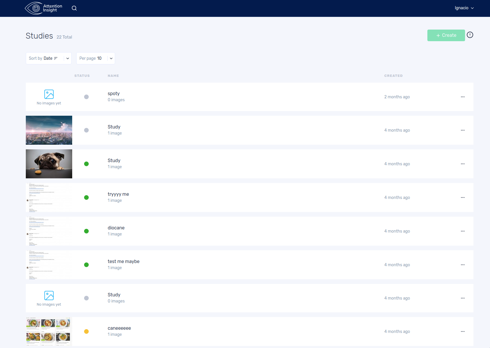
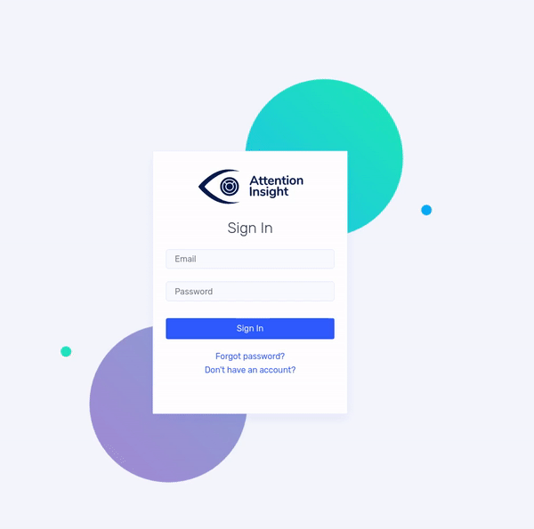
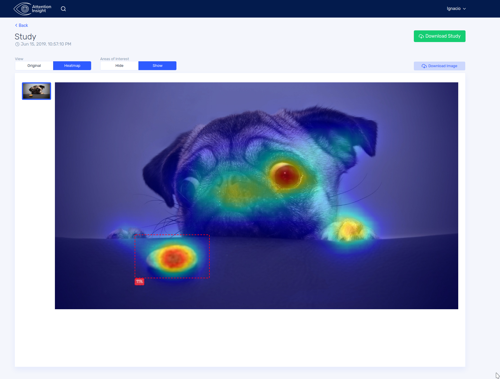
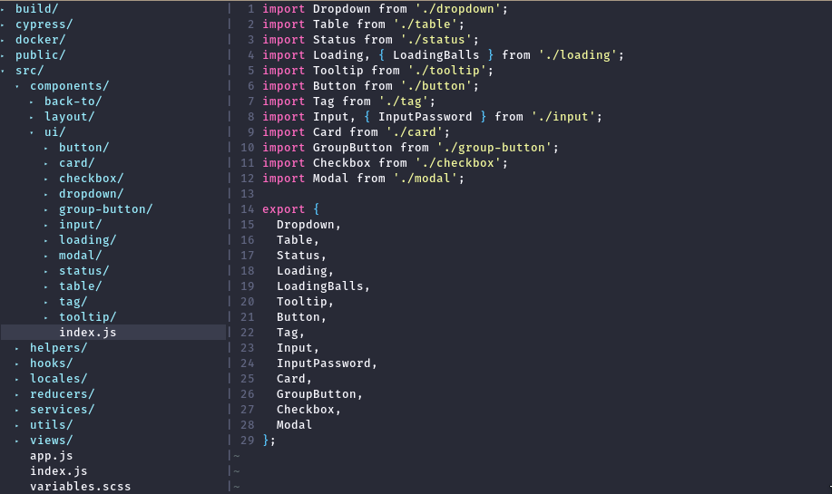
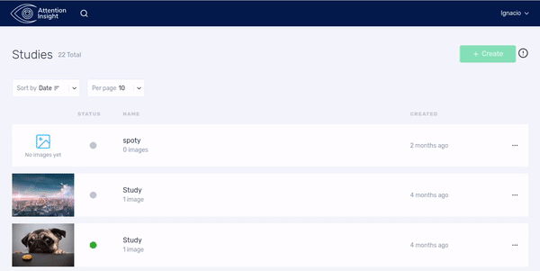

I got contacted by a friend of mine in early May 2019, they had their demo at NOAH19 Berlin (mid Jun) but they were having lots of trouble coming up with a good front-end for their dashboard. We started our conversations talking about what they were expecting, trying to narrow down the scope of the features they wanted to get done in the few weeks we had left and for me to try to understand their product and how things worked.

After upon analyzing their infrastructure (Laravel + react + jquery) I decided the best way forward was a do-over detaching the frontend code from the backend and utilizing the former simply as an API layer. This would mean that I was gonna be working on a more familiar frontend infrastructure that would allow me to move a lot faster than if I would have to clean up all the spagetthi and dependency mess from the existing product. Their only backend engineer started quickly working on finishing off the token based authentication, so that I could start consuming it with the new frontend project. Something that made it even faster for me to get on with it was that they already have a ton of documentation for their API based on swagger so the whole API integration with the new frontend was super smooth.

Right away I started working on the frontend architecture; I used create-react-app with create-app-rewired. That would allow me to not worry too much about the build process while giving me enough freedom to apply certain configurations: lodash optimization, webpack alias, custom eslintrc. If theres anything that I've suffered a lot with before, is taking projects that were not thought with internationalization in mind and having to translate everything after a year the project started. So with that in mind I also used LinguiJS to deal with all the translation flow and PO file compilation, since their devtooling experience is just insanely great.

Another big problem I had was that they did not have a designer, nor a well defined UI (not even a website!) so I had to come up with a visual guideline and colorscheme and get on with creating all the visual components. I took big inspiration on digital ocean and the VelocityUI kit from Invision to do so.

Once I had a bunch of components nailed down I started quickly prototyping the views for the dashboard and publishing the changes right away on now.sh so that they could start looking at it and getting early feedback about what I was working on. Once the first flows were done, I moved on the next one until I had all the views already created an using mocked data in redux. After all that effort, once the API was ready to be used, I started integrating the authentication flow, account creation and data retrieval into the store. So was a pretty painless process, that helped us catch a few bugs in the backend and in the UI side. After that was just a lot of fine tuning, getting animations right, tweaking copy and writting tests to ensure that the product worked fine.

## Other libraries I used

* React 16.8 with hooks pretty much everywhere
* Also used react-router, redux, and redux-toolkit: This allowed me to quickly prototype the whole data flow and state management for the app really quickly since it was the techs I'm most used to use.
* I wrote a little API wrapper for dealing with their Laravel API using axios.
* Prettier + eslint for code linting and formatting.
* Used date.fns for date handling
* Used formik for form state handling
* SASS with CSS Modules for styling everything
* All icons were react-feather
* Animations with framer-motion
* recompose for little util HOC's
* Testing: unit tests with Jest and integration tests with cypress
