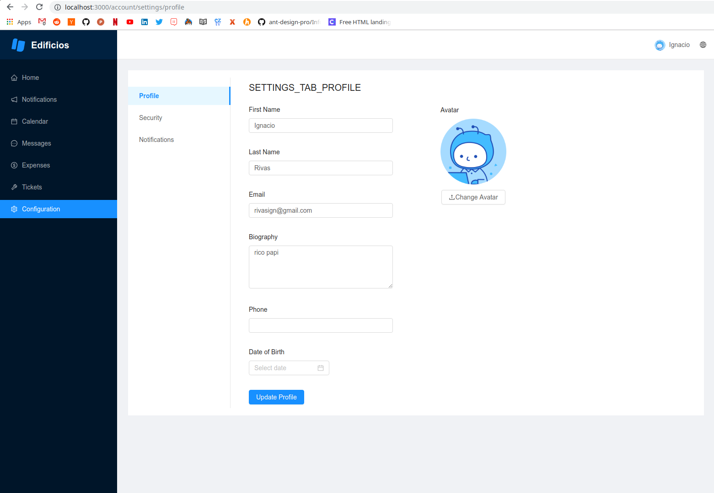

Edificios is a project that started in September 2018 and it's currently **under development**, it
aims to be a platform for managing everything related with a residential building. It has support
for all the roles that people and companies have over a building:

* Administrators: who deal with expenses, payouts to third-party's and legal stuff.
* Managers: People in charge of the maintenance building, arranging and scheduling repairs with third-party's and dealing with residents requests.
* Owners: People who own apartments in the complex.
* Tenants: Who actually live in the apartments.

The platform will allow users to:

* Submit tickets or requests to the managers/administrators. e.g: elevator not working, light bulb not working, etc.
* Calendar of events or booked shared spaces.
* Expenses due for each apartment.
* Parking spot management.
* Messaging: Message with your neighbours.
* Notifications.

Its currently being built with Koa, Postgres, React, Redux, Sagas, i18. And deployed to google cloud.
