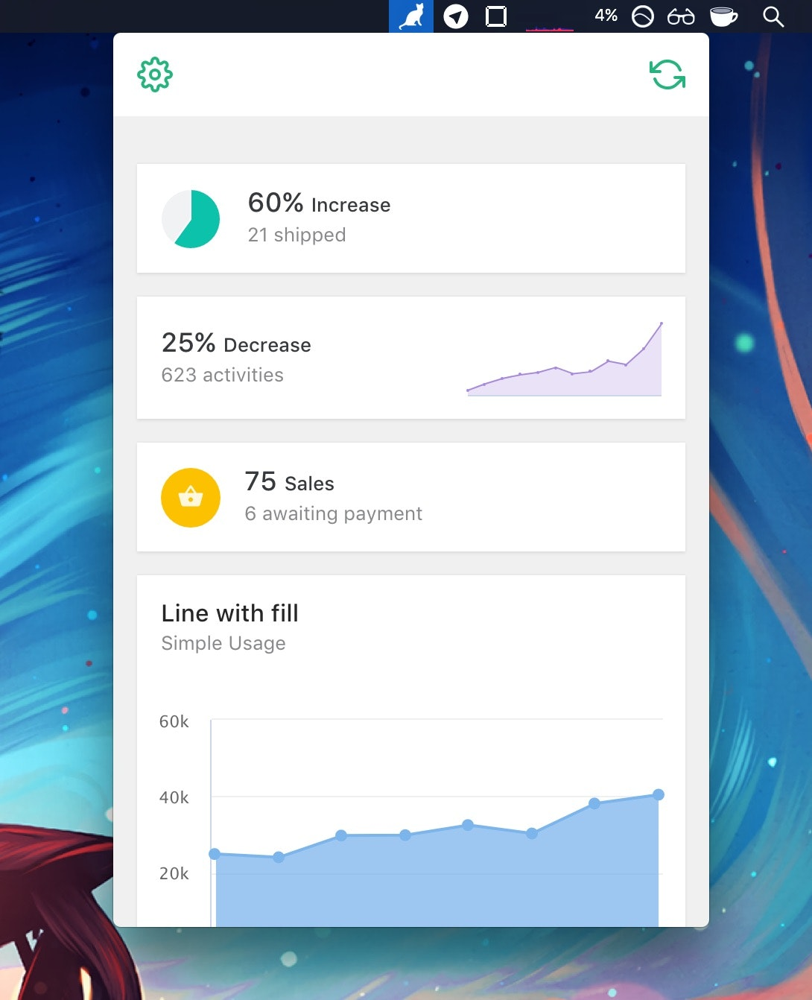
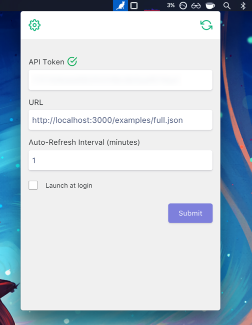

JSON-Menu was my last project from 2017. The idea came up from my [previous project](https://ignaciorivas.me/reminders-saas/),
because after I launched it I had to manually keep track of how many users I had, how many reminders
they had created, if I made any sales at all or not, if there were any feedback questions, etc. Things that
I could've been more at hand I thought, so the idea was already kind of forming by itself. So I
decided to try do something with Electron since I've never used it before.

Was really not that hard to be honest, and in about 2 months of work I had the app built and a
website with a stripe integration to allow users to buy an API key or do a free trial of 15 days.
Launch day came along and I pushed it to [product hunt](https://www.producthunt.com/posts/json-menu) with the hopes
that it would get as much traction as my previous project. Wrong. It barely got any views at all,
so obviously wasn't well marketed and landing page could've used some more love maybe some videos or demos
other than screenshots. At around the same time I submitted it to [beta-list](https://betalist.com/startups/json-menu) and after a few months
it got **featured** there and got quite some more traffic but no one actually converted to a paid user.

