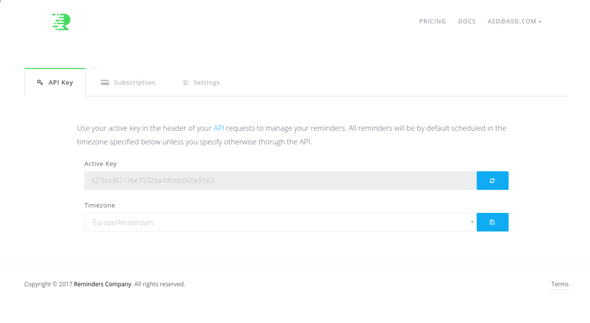
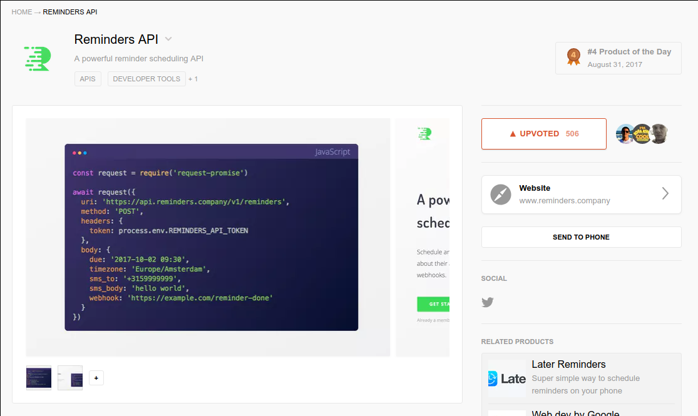
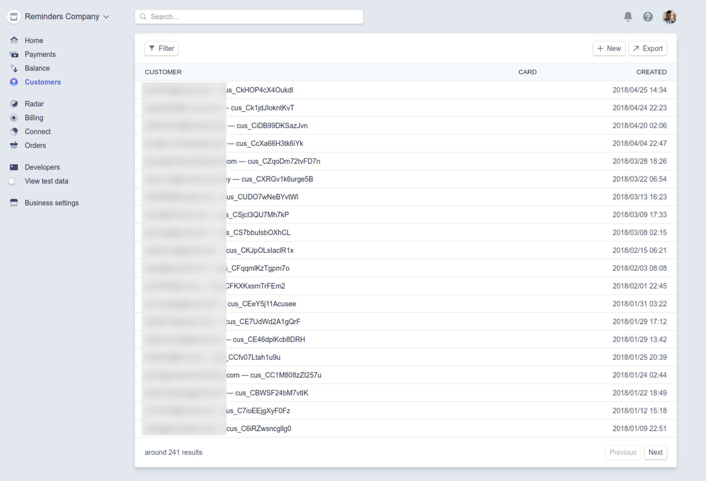

Reminders.company started as a spin off of another project I had going at
that time. I was working on a small website to allow users to signin and create
a bunch of reminders that are due on certain date/timezone and they would get a
simple email notification when it happens.

I was fiddling with the UI quite a bit, until it clicked to me that this isn't something
that anyone will use because it doesn't really solve a problem that another tool fixes
already, like a calendar reminder for example. So I decided to repack all that functionality
into an API and sell that API as a SAAS product targeted to developers. So that's what I did!

It took me about 3 months to get it done, working on it every day after I was done with my day-to-day
job. The platform was divided in 3 services:

* Website: A nodejs app with koa, postgres and stripe for managing subscriptions.
* API: The actual api users were iteracting with, using koa, postgres, redis and cronjobs.
* Docs: Based on [slate](https://github.com/lord/slate)

The platform was deployed in heroku, with a paid dyno, a basic postgres and redis store. When launch
day came, I patiently waited until producthunt submissions of the day were open and
once they were I finally push the submit button, also to hackernews and a few subreddits. Reaction from
users [was pretty good](https://www.producthunt.com/posts/reminders-api), got quite some traction through out those days and even made it to *4th product of the day*
which was quite an achievement for me. Got around 240 accounts created, out of those around 100
tested the product and only 2 people converted to paid users for only one month.

A few API marketplaces got in touch to see if I was interested in integrating my product
into their platform and one even offered to buy it for 300 bucks. But I felt like the
product and the experiment itself failed and didn't wanted to give it away for a few bucks;
there was obviously some interest on it but maybe the pricing wasn't adequate or it was
just missing something else that I didn't figure out back then.
